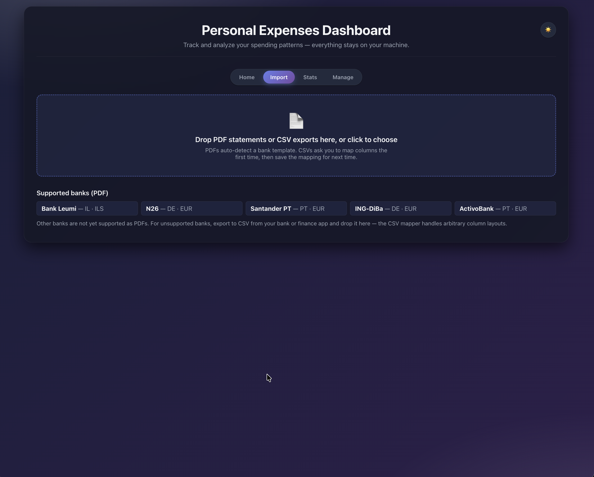
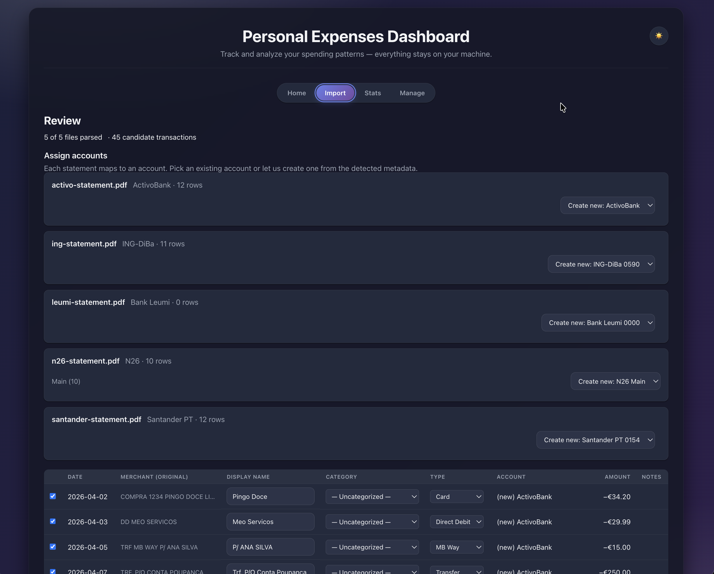

# Personal Expenses Dashboard

A single-page app that turns PDF and CSV bank exports into a local,
browsable transaction table — charts, filters, monthly totals, and
inline editing on every row. Everything runs in the browser.
Nothing leaves your machine, nothing touches a server, no account
required.

## Screenshots

**Stats dashboard** — multi-year trend, category and account
breakdowns, top merchants, headline cards. Categories collapse into
"Others" once the long tail starts cluttering the legend.


**Manage > Transactions** — unified search across every column, inline
date / category / account / type / display-name editing, lock toggle,
source filename, and a single Apply button for bulk edits.


**Manage > Rules** — one row per pattern, Display-name override and
Category assignment in the same table. Substring or regex.


**Manage > Categories** — usage counts, totals, per-category Income
and Excluded toggles (the Stats picker uses these as defaults).


**Import — pick & detect** — drop one or more PDFs or CSVs. Each PDF
gets matched to a bank template; each CSV gets routed through the
column mapper.



**Import — review** — assign accounts, fill in CSV-only metadata
(bank, currency, IBAN), pick a year inline if the statement didn't
embed one, edit categories and display names before commit.



## Why this exists

Most personal-finance tools want an account, a cloud sync, or
read-only access to your bank. This project does none of those.
You drop in a statement you already downloaded, the parser reads it
on the client, and the rows get stored in IndexedDB on the same
profile. If you clear site data, the dashboard forgets everything —
so the **Backup / restore** tab exists to let you keep JSON
snapshots somewhere private.

## What it does

- **Import PDFs** with auto-detection. The flow extracts the file
  with PDF.js, runs every bank template's `detect()` to pick a
  winner, previews the parsed rows, and lets you edit categories /
  display names / accounts before commit. Multi-account PDFs
  (e.g. N26 Main + Spaces) ask you which real account each group
  belongs to.
- **Import CSVs** from any system via a generic column mapper.
  First time you load a given CSV layout you map Date / Amount /
  Merchant / Category / Account / Notes columns, pick the date
  format and sign convention, and optionally save the mapping as a
  named template. Re-imports auto-pick the saved template by
  filename. Single-amount and split debit/credit-column conventions
  both supported.
- **Filename dedup at pick time** — the importer remembers every
  file you've imported before. If you accidentally drop the same
  statement twice, you get a confirmation dialog (skip vs. import
  anyway) before any duplicate work happens.
- **Translate non-English categories** — bank exports in German
  ("Lebensmittel"), Portuguese ("Alimentação"), Hebrew, French,
  Spanish, or Italian get normalised to canonical English category
  names at import time, so a cross-bank dataset never ends up with
  "Lebensmittel" and "Groceries" sitting side by side. The raw
  bank-provided value is preserved on `row.raw.bank_category` for
  audit.
- **Auto-categorise** using keyword rules + history matching.
  Manual category edits in any view auto-learn a rule keyed on the
  merchant's display name. Rules are visible, editable, and
  deletable on the unified **Manage > Rules** page.
- **Beautify merchants** — a brand-collapse engine strips noisy
  prefixes (MB WAY, COMPRA *, dates, payment-provider junk) and
  collapses variants of the same merchant ("LUFTHANSAFLT0193" /
  "LH 0234 FRA") into a single display name. The defaults ship as
  editable rules.
- **Per-transaction lock** — manual edits to a row's category or
  display name auto-lock that row, so future rule sweeps and
  re-imports leave it alone. The 🔒 column on Manage > Transactions
  and Stats > Recent Transactions toggles the lock manually.
- **Source filename column** — every imported row remembers which
  file it came from. Visible on Manage > Transactions and on the
  Duplicates table, sortable, with hover tooltips for long names.
- **Stats** — multi-year line chart, doughnut by category (with
  smart "Others" lump above 10 categories), top merchants bar,
  account pie. Multi-select category picker that defaults to your
  Manage settings (excluded + income categories start unchecked,
  per session). Live-editable Recent Transactions table with the
  same lock + display + category controls as Manage.
- **Persistent top nav** — Home / Import / Stats / Manage links
  always visible, active section highlighted. Hash-routed so the
  browser back button works.
- **Bulk edit, one Apply button** — select rows in Manage >
  Transactions, fill any subset of date / category / account / type
  / display name, click Apply once. Empty fields are skipped.
- **Unified search** — one search box hits every column on Manage
  and Stats Recent Transactions: merchant (display + raw),
  category, account, type, date, amount, notes, source filename.
- **Manage** tabs: Accounts (transaction counts + editable IBANs),
  Categories (income + exclude flags), Rules (one row per pattern),
  Duplicates (with the file column for forensics), Transactions,
  Import history, Backup / restore (full / transactions-only /
  settings-only / rules-only export and import), Danger zone.
- **Empty-state recovery** — if the local IndexedDB ever gets
  wedged the landing page surfaces an in-app repair flow: dump what
  it can, delete the DB, recreate at the current schema, restore.

## Supported banks

PDF parsers currently ship for:

- **Bank Leumi** (Israel) — credit card statements (RTL/Hebrew supported)
- **N26** (Germany) — current account statements (multi-account, Spaces)
- **Santander** (Portugal) — EXTRATO mensal checking account
- **ING-DiBa** (Germany) — Kontoauszug
- **ActivoBank** (Portugal) — EXTRATO COMBINADO

For anything else, **export to CSV from your bank or finance app**
and use the CSV column mapper — saves the mapping the first time so
re-imports skip the mapping step.

Adding a new PDF parser means dropping a file in `src/templates/`
that registers a matcher + parser with `App.templates.register`.
See [CONTRIBUTING.md](CONTRIBUTING.md). No other plumbing needed.

## Running it

The app is pure static HTML/JS — no build step, no server required.

**Easiest:** open `index.html` in a browser. Chrome, Firefox, Safari,
Edge all work.

**Better (recommended for PDF imports):** serve the folder over
HTTP. Some PDF.js code paths behave more reliably over `http://`
than `file://`. Anything that serves a directory will do, for
example:

```sh
# Python 3 (stdlib)
python3 -m http.server 8000

# Node (one-off, no install)
npx serve .
```

Then visit `http://localhost:8000/`.

## Try it with sample data

The `samples/` folder ships with everything you need to kick the
tires without uploading a real statement:

- `sample-backup.json` — a full backup with **295 transactions
  spanning 2024 → April 2026** across **16 categories** and 2
  accounts (a German N26 current account, a Portuguese ActivoBank
  joint account). Includes recurring patterns (salary, rent,
  utilities, internet, gym, streaming subscriptions) plus realistic
  variable spending (groceries, restaurants, transport, occasional
  travel and shopping bursts), 50+ keyword rules, 35+ display-name
  rules, and per-merchant overrides. Load via **Manage > Backup /
  restore > Import everything** — every chart on the Stats page
  immediately has interesting structure.
- `n26-statement.pdf`, `santander-statement.pdf`,
  `ing-statement.pdf`, `activo-statement.pdf`, `leumi-statement.pdf`
  — one synthetic PDF per template, shaped to match each parser's
  expected layout. Drop them into the Import flow one at a time to
  see each parser run end-to-end.

The sample PDFs contain only made-up transactions and placeholder
IBANs — safe to commit, safe to share.

## Privacy

- Everything is stored in IndexedDB, scoped to the browser profile
  and origin that loaded the page. It never crosses the network.
- The app pulls Chart.js and PDF.js from a CDN
  (`cdnjs.cloudflare.com`) with SRI integrity pins. If you want a
  fully air-gapped copy, vendor those libraries locally and swap
  the `<script>` URLs in `index.html`.
- Use **Manage > Backup / restore > Export everything** to get a
  JSON snapshot of your transactions, accounts, rules, and
  settings. Keep those backups somewhere private — the project
  `.gitignore` already excludes `kalkala-backup-*.json`.

## Project layout

```
src/
├── app.js              # boot: theme, storage open, route registration
├── styles.css          # design tokens, primitives (.btn .field .surface .pill .section-card .file-picker), per-view styles
├── core/               # shared infra used by every feature
│   ├── util.js         # el(), escapeHtml, formatters, modal, toast
│   ├── router.js       # hash-based router, file:// compatible, sets body[data-route]
│   ├── storage.js      # IndexedDB layer (DB v5) + export / repair / diagnose
│   └── pdf-loader.js   # on-demand PDF.js loader
├── templates/          # one file per bank — register + match + parse
│   ├── registry.js
│   ├── leumi.js  n26.js  santander.js  ing.js  activo.js
├── processing/         # cross-cutting data passes
│   ├── categorize.js   # keyword rule engine + history matching, locked-row aware
│   ├── csv.js          # generic CSV parser + mapping → canonical row
│   ├── duplicate.js    # signature-based dedupe
│   ├── transfer.js     # transfer-pair heuristic
│   ├── normalize.js    # merchant name beautifier + brand collapses
│   ├── translate.js    # DE / PT / HE / FR / ES / IT category → English
│   └── dates.js        # date sanity (future-date clamp, reanchor)
└── features/           # one folder per route
    ├── landing/        # hub + empty state + recovery UI
    ├── import/         # pick → parse (PDF) or map (CSV) → review → commit
    ├── manage/         # accounts, categories, rules, duplicates, transactions, history, backup, danger
    └── stats/          # the analytics dashboard
samples/                # sample PDFs + sample-backup.json (see above)
```

Everything uses the vanilla
`(function () { 'use strict'; window.App = ... })();`
pattern — no bundler, no transpiler, no ES modules. Script load
order is fixed by `index.html` and documented in the comment above
the script tags.

## Contributing

See [CONTRIBUTING.md](CONTRIBUTING.md) for the conventions around
IIFE modules, the `App.*` global, adding a bank template, and
running `node --check` before opening a PR.

## License

MIT — see [LICENSE](LICENSE).

## Disclaimer

This is a personal tool, not a financial product. The parsers are
best-effort pattern matching against real statements; always
sanity-check the imported rows before using them for anything that
matters. No warranty. No financial advice.
