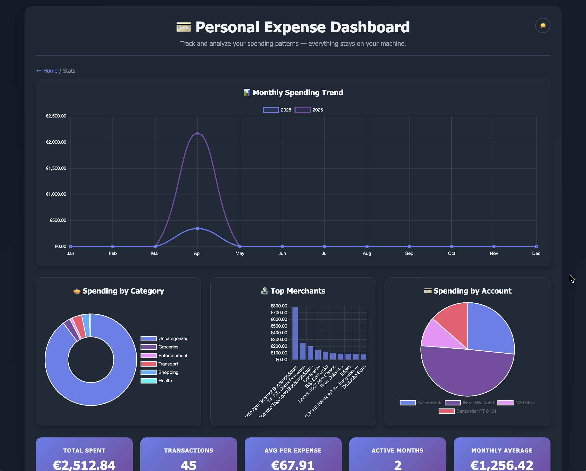
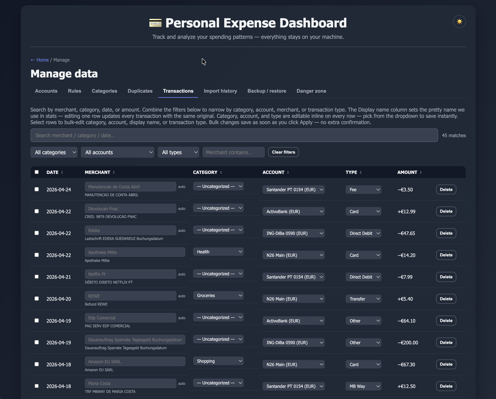
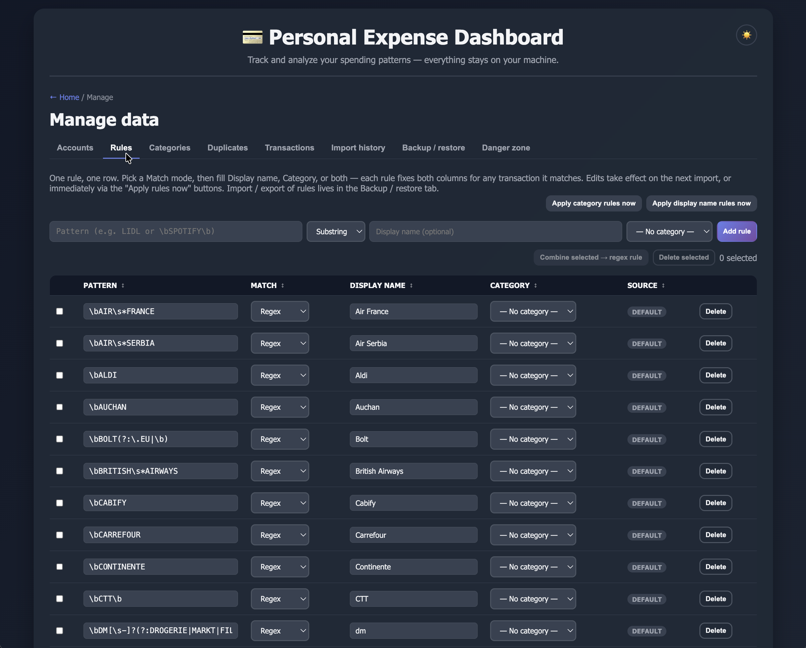
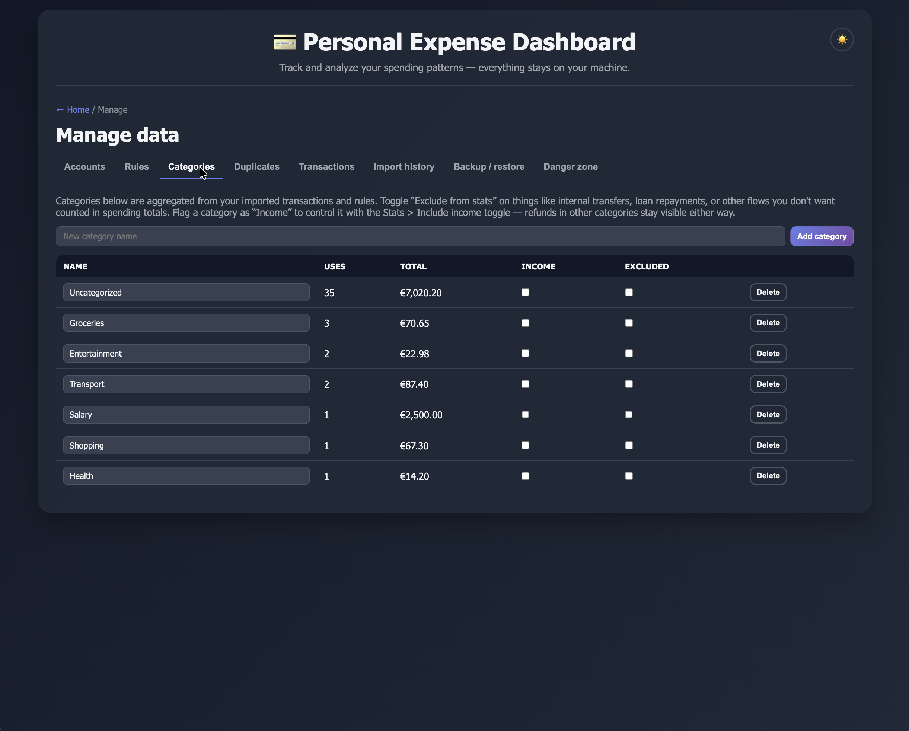

# Personal Expense Dashboard

A single-page app that imports PDF bank statements into a local table and
turns them into charts, filters, and monthly totals. Everything runs in
the browser — nothing leaves your machine, nothing touches a server.

## Screenshots

**Stats dashboard** — multi-year trend, category & account breakdowns,
top merchants, headline totals.



**Manage > Transactions** — search + filter, inline category / account /
type editing, original-vs-display merchant stack.



**Manage > Rules** — one row per pattern, with both a Display-name
override and a Category column. Match modes: substring or regex.



**Manage > Categories** — usage counts, totals, per-category Income and
Excluded toggles.



> **TODO** — add screenshots of the Landing hub and the Import review
> table once the next round of UI work lands. Place them in
> `docs/screenshots/` as `landing.png` and `import-review.png`.

## Why this exists

Most personal-finance tools need an account, a cloud sync, or direct
read-only access to your bank. This project does none of those. You drop
in a PDF you already downloaded from your bank, the parser reads it on
the client, and the transactions get stored in IndexedDB on the same
profile. If you clear site data, the dashboard forgets everything — so
the "export local data" button exists to let you keep backups.

## What it does

- **Import** a PDF statement from any supported bank. The import flow
  auto-detects the bank template, previews the parsed rows, lets you
  edit merchant display names and categories inline, and commits the
  reviewed batch. Multi-account PDFs (e.g. N26 Main + Spaces) ask you
  which real account each group belongs to before committing.
- **Deduplicate** on import — rows that match a prior transaction by
  date + amount + merchant are flagged. The Duplicates tab in Manage
  lets you dismiss false positives so they stop getting flagged.
- **Auto-categorize** using keyword rules. Manual category edits in the
  review table and in the Stats recent-transactions list are
  auto-learned as rules. Rules are visible, editable, and deletable on
  the unified **Manage > Rules** page (one row per pattern, with both a
  Display-name override and a Category assignment column).
- **Beautify merchants** — a brand-collapse engine strips noisy
  prefixes (MB WAY, COMPRA *, dates, VISA, payment-provider junk) and
  collapses variants of the same merchant into a single display name.
  You can add your own collapses as regex rules under Manage > Rules.
- **Analyze** — the Stats view has multi-year selection, category/
  account/merchant filters, income/expense split, monthly averages,
  and a live-editable Recent Transactions table (per-row category,
  account, type, and display-name edits).
- **Sortable tables** everywhere — click any column header in Rules,
  Manage Transactions, or the Stats Recent Transactions list to toggle
  ascending/descending by that column. Amount sorts on absolute value
  so income and expense rows sort together.
- **Income-vs-expense filter** — categories flagged as *income* (e.g.
  "Income", "Salary") are hidden by default in spend totals. The
  "Include income categories" toggle in Stats flips them back in. A
  refund booked under a non-income category (e.g. a refund to
  Groceries) stays visible regardless.
- **Manage** — accounts (with transaction counts + editable IBANs),
  categories (with the "is income" and "exclude" flags), keyword +
  display rules, per-merchant overrides, duplicate dismissals, import
  history, and full JSON backup/restore. Two separate restore options:
  *Import everything* (transactions + settings, mirrors a full export)
  and *Import settings only* (accounts, categories, rules, merchants
  — no transactions). There's also an in-app recovery flow for when
  the browser's IndexedDB layer gets wedged.

## Supported banks

PDF parsers currently ship for:

- **Bank Leumi** (Israel) — credit card statements (RTL/Hebrew supported)
- **N26** (Germany) — current account statements (multi-account, Spaces)
- **Santander** (Portugal) — EXTRATO mensal checking account
- **ING-DiBa** (Germany) — Kontoauszug
- **ActivoBank** (Portugal) — EXTRATO COMBINADO

Adding a new bank means dropping a file in `src/templates/` that
registers a matcher + parser with `App.templates.register`. See
[CONTRIBUTING.md](CONTRIBUTING.md). No other plumbing needed.

## Running it

The app is pure static HTML/JS — no build step, no server required.

**Easiest:** open `index.html` in a browser. Chrome, Firefox, Safari,
Edge all work.

**Better (recommended for PDF imports):** serve the folder over HTTP.
Some PDF.js code paths behave more reliably over `http://` than
`file://`. Anything that serves a directory will do, for example:

```sh
# Python 3 (stdlib)
python3 -m http.server 8000

# Node (one-off, no install)
npx serve .
```

Then visit `http://localhost:8000/`.

## Try it with sample data

The `samples/` folder ships with everything you need to kick the tires
without uploading a real statement:

- `sample-backup.json` — a full backup (40 transactions across
  Feb–Apr 2026, 2 accounts, 5 categories including one income-flagged,
  10 keyword rules, 5 brand-collapse rules, and per-merchant display
  overrides). Load it via **Manage > Backup / Restore > Import
  everything**.
- `n26-statement.pdf`, `santander-statement.pdf`, `ing-statement.pdf`,
  `activo-statement.pdf`, `leumi-statement.pdf` — one synthetic PDF
  per template, shaped to match each parser's expected layout. Drop
  them into the Import flow one at a time to see each parser in
  action.

The sample PDFs contain only made-up transactions and placeholder
IBANs — safe to commit, safe to share.

## Privacy

- Everything is stored in IndexedDB, scoped to the browser profile and
  origin that loaded the page. It never crosses the network.
- The app pulls Chart.js and PDF.js from a CDN (`cdnjs.cloudflare.com`)
  with SRI integrity pins. If you want a fully air-gapped copy, vendor
  those libraries locally and swap the `<script>` URLs in `index.html`.
- Use the **Export local data** button to get a JSON snapshot of your
  transactions, accounts, rules, and settings. Keep those backups
  somewhere private — the project `.gitignore` already excludes
  `kalkala-backup-*.json`.

## Project layout

```
src/
├── app.js              # boot: theme, storage open, route registration
├── styles.css
├── core/               # shared infra used by every feature
│   ├── util.js         # el(), escapeHtml, formatters, modal, toast
│   ├── router.js       # hash-based router, file:// compatible
│   ├── storage.js      # IndexedDB layer + export/repair/diagnose
│   └── pdf-loader.js   # on-demand PDF.js loader
├── templates/          # one file per bank — register + match + parse
│   ├── registry.js
│   ├── leumi.js  n26.js  santander.js  ing.js  activo.js
├── processing/         # cross-cutting data passes
│   ├── categorize.js   # keyword rule engine + history matching
│   ├── duplicate.js    # signature-based dedupe
│   ├── transfer.js     # transfer-pair heuristic
│   ├── normalize.js    # merchant name beautifier + brand collapses
│   └── dates.js        # date sanity (future-date clamp, reanchor)
└── features/           # one folder per route
    ├── landing/        # hub + empty state + recovery UI
    ├── import/         # PDF pick → parse → review → commit
    ├── manage/         # accounts, categories, rules, duplicates, backups
    └── stats/          # the analytics dashboard
samples/                # sample PDFs + sample-backup.json (see above)
```

Everything uses the vanilla `(function () { 'use strict'; window.App = ... })();`
pattern — no bundler, no transpiler, no ES modules. Script load order is
fixed by `index.html` and documented in the comment above the script
tags.

## Contributing

See [CONTRIBUTING.md](CONTRIBUTING.md) for the conventions around
IIFE modules, the `App.*` global, adding a bank template, and running
`node --check` before opening a PR.

## License

MIT — see [LICENSE](LICENSE).

## Disclaimer

This is a personal tool, not a financial product. The parsers are
best-effort pattern matching against real statements; always sanity-check
the imported rows before using them for anything that matters. No
warranty. No financial advice.
